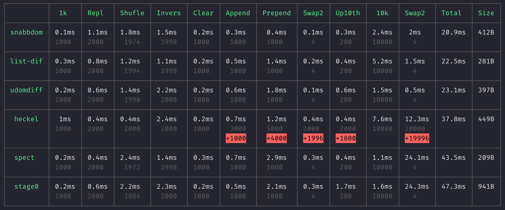

# js-diff-benchmark

Simple benchmark for testing your DOM diffing algorithm.

## Ranking

| Position | Library | Size | Speed |
| --- | --- | --- | --- |
| 🏆 1 | [udomdiff](https://github.com/WebReflection/udomdiff) | 388B | ~18ms |
| 2 | [list-difference](https://github.com/paldepind/list-difference/) | 281B | ~21ms |
| 3 | [snabbdom](https://github.com/snabbdom/snabbdom) | 412B | ~21ms |
| 4 | [heckel](https://johnresig.com/projects/javascript-diff-algorithm/) | 449B | ~37ms |
| 5 | [spect](https://github.com/spectjs/spect) | 209B | ~43.5ms |
| 6 | [stage0](https://github.com/Freak613/stage0) | 941B | ~47ms |

## Screenshot

## Credits

Benchmark code based on the tests in [udomdiff](https://github.com/WebReflection/udomdiff).
